# Aaron Karsten

**Robotics and Automation Engineer** | Tempe, AZ

I helped scale a fleet of robotic handwriting machines from zero to 200+ units.

**[Resume](assets/resume.pdf)** &nbsp;|&nbsp; **[LinkedIn](https://www.linkedin.com/in/aaron-karsten)**

 

<table><tr><td align="center"><b>200+</b> machines in production</td><td align="center"><b>30,000</b> letters per day</td><td align="center"><b>96%</b> fleet uptime (OEE)</td><td align="center"><b>10 h to 3.5 h</b> mean time to repair</td></tr></table>

## About

I’m a robotics engineer based in Tempe, Arizona. At Handwrytten I helped scale a fleet of proprietary robotic handwriting machines from 0 to 200+ units producing 30,000 letters a day. I built the automated inspection machines, shipped custom PCBs, and set up the fleet telemetry.

Outside work I build across the stack: SolidWorks CAD, KiCAD PCBs, PLC programs in CODESYS and on Arduino Opta, and YOLOv8 vision on a Raspberry Pi 5 with a Hailo-8L. I also write desktop software in Python and TypeScript, and I'm learning MIG welding.

My Handwrytten role ended in September 2026. I'm looking for robotics, controls or automation engineering roles in the Phoenix metro or remote.

## Engineering

<table>
<tr>
<td width="50%" valign="top">

### [Robotic fleet at production scale](work/handwrytten-fleet.md)

Sep 2023 to Sep 2026 | Robotics Engineer II, Handwrytten

0 to 200+ proprietary handwriting machines, 30,000 letters per day

<b>96%</b> fleet uptime via OEE <b>3-person</b> steady-state support team

</td>
<td width="50%" valign="top">

### [PLC controls](work/plc-controls.md)

2026 | Controls | In progress

CODESYS and Factory I/O over Modbus TCP, ladder on Arduino Opta, Allen Bradley tags from Python

<b>11</b> faults debugged and written up <b>Opta + Portenta</b> real hardware

</td>
</tr>
<tr>
<td width="50%" valign="top">

### [Edge inference on a Raspberry Pi 5](work/pi-fleet-edge-ml.md)

2026 | Computer vision and ML | In progress

Hailo-8L NPU, YOLOv8 + ByteTrack, Florence-2 defect demo

<b>144.7 FPS</b> YOLOv8n on the Hailo-8L <b>6.84 ms</b> p50 inference latency

</td>
<td width="50%" valign="top">

### [LANL Robotic Glovebox](work/lanl-glovebox.md)

Aug 2023 to Apr 2024 | Project Manager, 3-person team

UR5e glovebox automation with a flight-stick digital twin

<b>100%</b> project milestones delivered <b>6-DOF</b> UR5e workcell

</td>
</tr>
</table>

## Software

<table>
<tr>
<td width="33%" valign="top">

**[Walrus](projects.md#walrus-local-coding-agent-for-the-terminal)** local coding agent for the terminal

A Claude Code-style coding agent for the terminal that runs entirely on local Ollama models.

[Source on GitHub](https://github.com/aaronk2001/walrus)

</td>
<td width="33%" valign="top">

**[Text-to-Speech](projects.md#text-to-speech-local-desktop-app-for-windows)** local desktop app for Windows

A local-first Windows text-to-speech app.

[Source on GitHub](https://github.com/aaronk2001/text-to-speech)

</td>
<td width="33%" valign="top">

**[MMM](projects.md#mmm-personal-finance-desktop-app)** personal finance desktop app

A local-first personal finance app with a rule-based coach.

</td>
</tr>
</table>

## Experience

### Robotics Engineer II
**Handwrytten** | Sep 2023 to Sep 2026 Promoted from Robotics Engineer Intern (Sep 2023 to Jun 2024) in 10 months

- Helped scale a proprietary fleet of robotic handwriting machines from 0 to 200+ units producing 30,000 letters/day. 3× output growth.
- Led the ramp team of 6 (2 engineers, 4 technicians) deploying ~6 machines/week.
- Designed and built 2 automated inspection machines on Arduino Opta and Portenta Machine Control PLCs, cutting labor cost $100K+/year, and deployed YOLO/PyTorch vision inspecting 30,000 letters/day in real time.
- Stood up fleet telemetry: live machine status to AWS, an SQL pipeline computing OEE (96% uptime), and Prometheus/Grafana fault detection that cut MTTR from 10 to 3.5 hours.
- Shipped 4 custom PCBs (EasyEDA) to the fleet and stood up a fabrication cell producing 500+ parts/month, cutting custom-part lead time from 4+ weeks to under 1 week.
- Installed and supported leased robots at customer sites across the US with a 24-hour response and 90%+ customer uptime.

[Read the case study: Robotic fleet at production scale](work/handwrytten-fleet.md)

### Project Manager, Robotic Glovebox Capstone
**Los Alamos National Laboratory × ASU** | Aug 2023 to Apr 2024

- Led a 3-person team through an 8-month LANL-sponsored project automating glovebox operations with a 6-DOF UR5e.
- Designed the workcell in SolidWorks, simulated and validated motion in RoboDK, and wrote URScript control routines.
- Built a flight-stick digital twin via a Python bridge for intuitive teleoperation.
- Delivered 100% of project milestones.

[Read the case study: LANL Robotic Glovebox](work/lanl-glovebox.md)

### B.S.E. Robotics Engineering, Ira A. Fulton Schools of Engineering
**Arizona State University** | Graduated Dec 2024

- Coursework covered kinematics, control systems, embedded systems, computer vision, and machine learning.
- Senior capstone: the LANL robotic glovebox project above.

## In progress

| Discipline | Projects |
|---|---|
| **Robotics** | [6-DOF robot arm](projects.md#6-dof-robot-arm-cad-controller-board-and-firmware) [RobotCar](projects.md#robotcar-autonomous-fpv-rover) |
| **Fabrication** | [Arcade cabinet](projects.md#arcade-cabinet-solidworks-enclosure) |
| **Software** | [Ascent](projects.md#ascent-career-os-desktop-app) ([code](https://github.com/aaronk2001/ascent-career-os)) [Phantom](projects.md#phantom-short-form-video-automation) [PolyMarked](projects.md#polymarked-polymarket-wallet-scoring-agent) ([code](https://github.com/aaronk2001/polymarked)) |

**[Write-ups for all 16 projects](projects.md)**

## Skills

**Robotics & Systems:** ROS2, Python, C++, UR5e / URScript, Raspberry Pi 5, MicroPython, PCA9685 
**Computer Vision & ML:** YOLOv8, OpenCV, Hailo-8L NPU, ONNX, PyTorch 
**Controls & Automation:** Arduino Opta / Portenta, CODESYS, EtherNet/IP, Modbus 
**Fabrication:** KiCAD, EasyEDA, SolidWorks, 3D Printing 
**Foundations:** Linux, Git, Docker, Prometheus, Grafana, Flask, Next.js, TypeScript, Bun, SQLite, Claude API, Ollama

<b>Education and certifications</b>

| Credential | Issuer | Status |
|---|---|---|
| [BSE Robotics Engineering](https://engineering.asu.edu/robotics/) | Arizona State University | 2024 |
| [UR Academy Certification](https://academy.universal-robots.com) | Universal Robots | 2023 |
| [Machine Learning Crash Course](https://developers.google.com/machine-learning/crash-course) | Google | In progress |
| [Rockwell Automation Training](https://www.rockwellautomation.com/en-us/training.html) | Rockwell Automation | In progress |
| [Practical Deep Learning for Coders](https://course.fast.ai) | fast.ai | In progress |

## Contact

Tempe, AZ. Open to robotics, controls and automation roles, Phoenix metro or remote. Reach me on [LinkedIn](https://www.linkedin.com/in/aaron-karsten), or read the [Resume](assets/resume.pdf).
