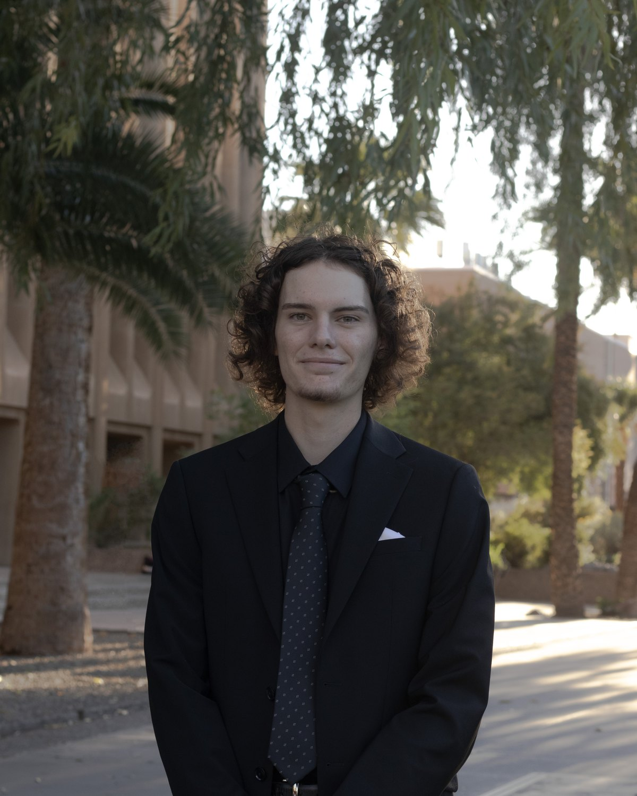
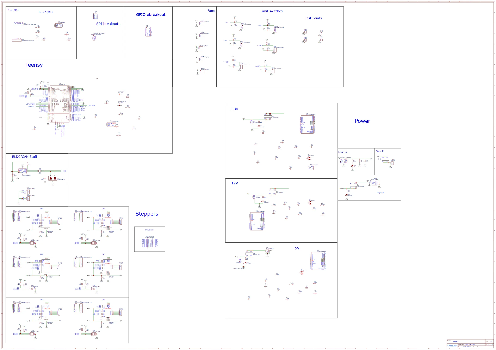
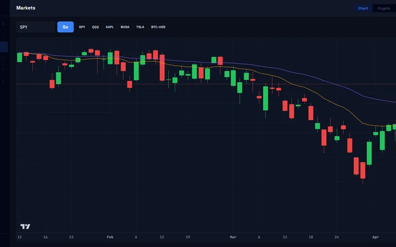
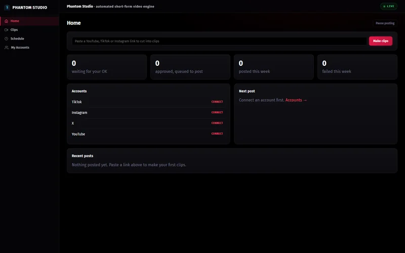

<h1 align="center">Aaron Karsten</h1>

<b>Robotics and Automation Engineer</b> | Tempe, AZ

I took a fleet of robotic handwriting machines from zero to 200+ units. I build the PLC automation, vision QA, custom PCBs, and telemetry that keep production running.

<a href="assets/resume.pdf"><b>Resume (PDF)</b></a> &nbsp;|&nbsp; <a href="https://www.linkedin.com/in/aaron-karsten"><b>LinkedIn</b></a> &nbsp;|&nbsp; <a href="projects.md"><b>All projects</b></a>

<table><tr><td align="center"><b>200+</b> machines in production</td><td align="center"><b>30,000</b> letters per day</td><td align="center"><b>96%</b> fleet uptime (OEE)</td><td align="center"><b>10 h to 3.5 h</b> mean time to repair</td></tr></table>

> Tempe, AZ. Open to robotics, controls and automation roles, Phoenix metro or remote.

## About

<table><tr>
<td width="28%" valign="top"></td>
<td valign="top">

I’m a robotics engineer based in Tempe, Arizona. At Handwrytten I helped scale a fleet of proprietary robotic handwriting machines from 0 to 200+ units producing 30,000 letters a day. I built the automated inspection machines, shipped custom PCBs, and ran the telemetry that keeps it all in production.

My background spans the full stack of physical engineering: from SolidWorks CAD and KiCAD PCB design to YOLOv8 computer vision on edge hardware (Hailo-8, Raspberry Pi 5) and PLC programming in Codesys and on Arduino Opta. I’m currently adding welding to that list. Phase 1 MIG is underway.

The work I care most about sits where hardware and software meet. Hardware is the harder thing to fake, and the discipline that keeps software honest. My Handwrytten role ended in September 2026, so I’m looking for the next one. Robotics, controls, or automation engineering, in the Phoenix metro or remote.

</td>
</tr></table>

## Selected work

<table>
<tr>
<td width="50%" valign="top">

### [Robotic fleet at production scale](work/handwrytten-fleet.md)

Sep 2023 to Sep 2026 | Robotics Engineer II, Handwrytten

0 to 200+ proprietary handwriting machines, 30,000 letters per day

<b>0 to 200+</b> machines in production <b>30,000</b> letters/day, 3x growth

</td>
<td width="50%" valign="top">

### [Six-axis robot arm, from CAD to firmware](work/robot-arm.md)

2026 | Design, electronics and firmware

V4 design, Teensy controller, ROS2 driver stack

<b>6</b> axes <b>24</b> schematic sheets

</td>
</tr>
<tr>
<td width="50%" valign="top">

### [Twelve-node Pi cluster with edge inference](work/pi-fleet-edge-ml.md)

2026 | Infrastructure and ML

Kubernetes, Hailo-8 NPU, YOLOv8 vision, Prometheus telemetry

<b>12</b> nodes <b>26 TOPS</b> Hailo-8 NPU

</td>
<td width="50%" valign="top">

### [PLC integration and a controls lab](work/plc-controls.md)

2026 | Controls

Allen Bradley bridge, Modbus, OPC-UA, hardware-free CI

<b>EtherNet/IP + OPC-UA</b> one interface <b>Simulator</b> hardware-free CI

</td>
</tr>
<tr>
<td width="50%" valign="top">

### [LANL Robotic Glovebox](work/lanl-glovebox.md)

Aug 2023 to Apr 2024 | Project Manager, 3-person team, ASU capstone sponsored by Los Alamos National Laboratory

UR5e glovebox automation with a flight-stick digital twin

<b>100%</b> project milestones delivered <b>6-DOF</b> UR5e workcell

</td>
</tr>
</table>

## Experience

### Robotics Engineer II
**Handwrytten** | Sep 2023 to Sep 2026 Promoted from Robotics Engineer Intern (Sep 2023 to Jun 2024) in 10 months

Helped scale a proprietary fleet of robotic handwriting machines from 0 to 200+ units producing 30,000 letters/day. 3× output growth. Led the ramp team of 6 (2 engineers, 4 technicians) deploying ~6 machines/week. Designed and built 2 automated inspection machines on Arduino Opta and Portenta Machine Control PLCs, cutting labor cost $100K+/year, and deployed YOLO/PyTorch vision inspecting 30,000 letters/day in real time. Stood up fleet telemetry: live machine status to AWS, an SQL pipeline computing OEE (96% uptime), and Prometheus/Grafana fault detection that cut MTTR from 10 to 3.5 hours. Shipped 4 custom PCBs (EasyEDA) to the fleet and stood up a fabrication cell producing 500+ parts/month, cutting custom-part lead time from 4+ weeks to under 1 week. Installed and supported leased robots at customer sites across the US with a 24-hour response and 90%+ customer uptime.

`0 to 200+ machines` `30,000 letters/day (3×)` `96% uptime (OEE)` `MTTR 10h to 3.5h` `$100K+/year labor saved` `Field installs at US customer sites: 24h response, 90%+ uptime`

### Project Manager, Robotic Glovebox Capstone
**Los Alamos National Laboratory × ASU** | Aug 2023 to Apr 2024

Led a 3-person team through an 8-month LANL-sponsored project automating glovebox operations with a 6-DOF UR5e. Designed the workcell in SolidWorks, simulated and validated motion in RoboDK, and wrote URScript control routines. Built a flight-stick digital twin via a Python bridge for intuitive teleoperation. Delivered 100% of project milestones.

`6-DOF UR5e` `Flight-stick digital twin` `100% milestones` `PM, 3-person team`

### B.S.E. Robotics Engineering, Ira A. Fulton Schools of Engineering
**Arizona State University** | Graduated Dec 2024

Coursework covered kinematics, control systems, embedded systems, computer vision, and machine learning. Senior capstone: the LANL robotic glovebox project above.

## Projects

<table>
<tr>
<td width="33%" valign="top">

**[Homelab Monitoring Stack](projects.md#homelab-monitoring-stack)**

Full observability stack for the 12-node Pi cluster on k3s: Prometheus scrapes node metrics, Loki aggregates logs, Grafana renders dashboards, and Alertmanager routes threshold alerts to a Discord webhook.

</td>
<td width="33%" valign="top">

**[YOLOv8 edge inference on Hailo-8](projects.md#yolov8-edge-inference-on-hailo-8)**

YOLOv8n object detection and ByteTrack tracking compiled to the Hailo-8 NPU on a Raspberry Pi 5.

[Source on GitHub](https://github.com/aaronk2001/yolov8-hailo-pi5)

</td>
<td width="33%" valign="top">

**[V3 ARM Controller PCB](projects.md#v3-arm-controller-pcb)**

KiCAD-designed four-layer PCB built with SKiDL Python harness.

</td>
</tr>
<tr>
<td width="33%" valign="top">

**[NEXUS Desktop Trading Terminal](projects.md#nexus-desktop-trading-terminal)**

Trading terminal merged into a single Electron desktop app: live candlestick charts, a signal-accuracy ledger, an options chain with Greeks, DCF equity research, and a multi-agent debate desk (analysts to bull/bear to trader to risk) running paper-only on a local model.

</td>
<td width="33%" valign="top">

**[Ascent, career tracker](projects.md#ascent-career-tracker)**

Flask + pywebview desktop app that runs the job search: an hour-by-hour day planner backed by a YAML schedule, application and goal tracking, a skills radar, a local-Ollama resume tailor that emits .docx, and an interactive Gantt aggregating every track.

[Source on GitHub](https://github.com/aaronk2001/ascent-career-os)

</td>
<td width="33%" valign="top">

**[Walrus, local Ollama agent desktop](projects.md#walrus-local-ollama-agent-desktop)**

Tauri 2 + React + Bun desktop app that runs a fully local agent on Ollama (qwen3:4b) with 7 tools.

</td>
</tr>
<tr>
<td width="33%" valign="top">

**[PolyMarked, autonomous agent](projects.md#polymarked-autonomous-agent)**

A single-process desktop agent with an event-driven architecture: a uv-workspace monorepo (8 packages) running a wallet watcher, decision engine, FastAPI dashboard, and Telegram bot together under one tray supervisor on a single asyncio event loop.

</td>
<td width="33%" valign="top">

**[Local TTS Desktop App](projects.md#local-tts-desktop-app)**

A local-first, MIT-licensed Windows text-to-speech app in PySide6: pluggable engines (neural-ONNX Piper, Windows SAPI5, eSpeak-NG), a global clipboard hotkey, and a typed, tested codebase.

</td>
<td width="33%" valign="top">

**[Phantom Studio, video automation engine](projects.md#phantom-studio-video-automation-engine)**

A full automated short-form video pipeline.

</td>
</tr>
<tr>
<td width="33%" valign="top">

**[Phantom Clips, local video pipeline](projects.md#phantom-clips-local-video-pipeline)**

YouTube URL to finished 9:16 clip entirely on one machine: yt-dlp ingest, faster-whisper transcription on CUDA, an LLM segment picker, an NVENC render with burned captions, and a keyboard-driven review UI over a SQLite job queue.

</td>
<td width="33%" valign="top">

**[MMM: money hub](projects.md#mmm-money-hub)**

Local-first Monarch-style personal-finance app for spending tracking and insights.

</td>
<td width="33%" valign="top">

**[PLC Track, desktop learning tracker](projects.md#plc-track-desktop-learning-tracker)**

A Tauri 2 + React desktop app that tracks progress through the controls learning path from a YAML curriculum file.

</td>
</tr>
</table>

**[See all 26 projects, grouped by discipline](projects.md)**

## Skills

**Robotics & Systems:** **ROS2**, **Python**, C++, **UR5e / URScript**, **Raspberry Pi 4/5**, MicroPython, PCA9685 
**Computer Vision & ML:** YOLOv8, **OpenCV**, ONNX, Label Studio 
**Controls & Automation:** Studio 5000 / RSLogix, Allen Bradley, EtherNet/IP, Modbus, SCADA 
**Fabrication:** **KiCAD**, **SolidWorks**, Fusion 360, **3D Printing**, OpenSCAD, Sheet Metal 
**Foundations:** **Linux**, **Git**, Docker, Ansible, Prometheus, Grafana, **Flask**, Next.js, **TypeScript**, Bun, PostgreSQL, **SQLite**, **Claude API**, Ollama

<b>Education and certifications</b>

| Credential | Issuer | Status |
|---|---|---|
| [BSE Robotics Engineering](https://engineering.asu.edu/robotics/) | Arizona State University | 2024 |
| [UR Academy Certification](https://academy.universal-robots.com) | Universal Robots | 2023 |
| [Machine Learning Crash Course](https://developers.google.com/machine-learning/crash-course) | Google | In progress |
| [Rockwell Automation Training](https://www.rockwellautomation.com/en-us/training.html) | Rockwell Automation | In progress |
| [Practical Deep Learning for Coders](https://course.fast.ai) | fast.ai | In progress |

## Now (September 2026)

- **CODESYS + Factory I/O controls sprint:** ladder and ST against simulated plants
- **V3 ARM controller PCB:** SKiDL to KiCad netlist, ESP32-S3 motor drive
- **Edge ML on Hailo-8:** YOLOv8 + VLM defect inspection (26 TOPS)

## Contact

Open to conversations about robotics, controls, and automation roles. Reach me on [LinkedIn](https://www.linkedin.com/in/aaron-karsten) or grab the [resume](assets/resume.pdf). Based in Tempe, AZ.
