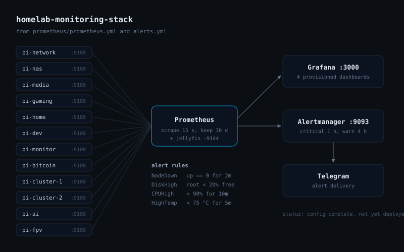
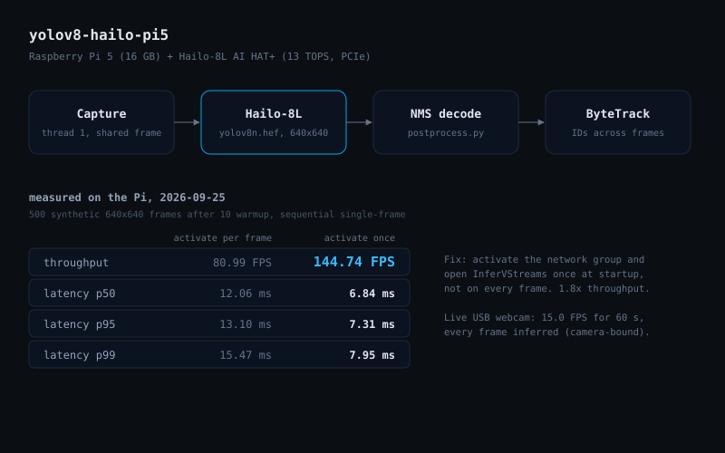
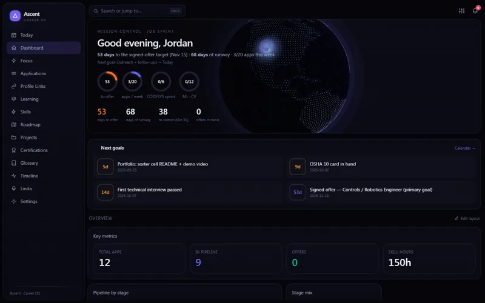
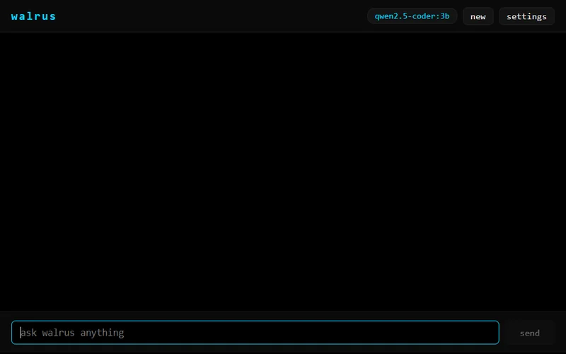
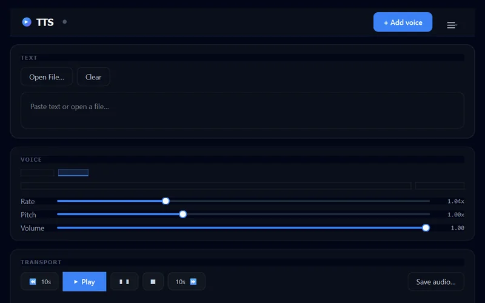
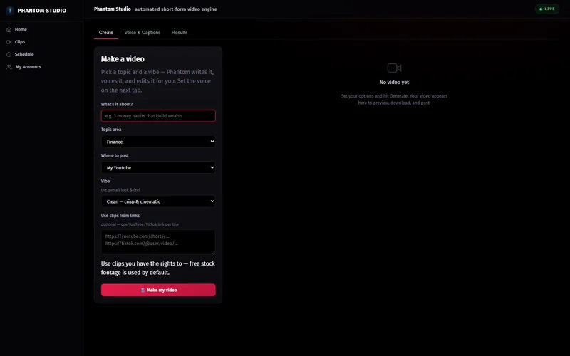
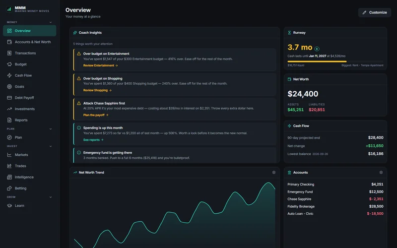
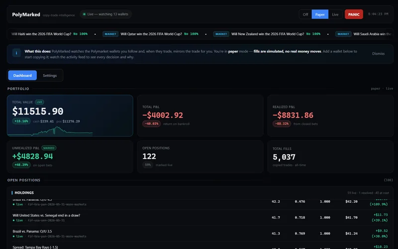
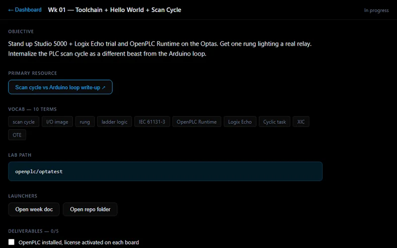

[Back to portfolio](README.md)

# Projects

17 projects across robotics, controls, vision and software.

[Robotics](#robotics) | [Controls & Automation](#controls--automation) | [Computer Vision & ML](#computer-vision--ml) | [Fabrication](#fabrication) | [Software](#software)

## Robotics

### 200+ robot fleet at Handwrytten

2023-2026 | Complete

Helped scale Handwrytten's proprietary fleet of robotic handwriting machines from 0 to 200+ units producing 30,000 letters/day. 3× output growth. Promoted from Robotics Engineer Intern to Robotics Engineer II in 10 months while leading the fleet ramp team.

- 0 to 200+ machines deployed
- 30,000 letters/day (3× growth)
- 96% fleet uptime via OEE
- MTTR 10h to 3.5h (65% reduction)
- $100K+/year labor saved
- 4 custom PCBs shipped to fleet

`Python` `YOLO / PyTorch` `PLC / Ladder Logic` `EasyEDA` `AWS` `SQL` `Prometheus` `Grafana`

[Case study: Robotic fleet at production scale](work/handwrytten-fleet.md)

How it works

Handwrytten (granted patents US 11,052,693 & US 11,260,686) runs a fleet of 200+ proprietary robotic handwriting machines, tripling output from 10,000 to 30,000 letters per day. Every machine runs a multi-threaded Python control application and operates autonomously from a single barcode scan, dynamically pulling jobs from the cloud over WiFi.

Each machine posts live status to AWS, processed through an SQL pipeline into OEE metrics (availability = machines available ÷ total machines). the fleet holds 96% uptime. Prometheus/Grafana telemetry and fault detection cut mean time to repair from 10 hours to 3.5 hours (a 65% reduction). I led the ramp team of 6 (2 engineers, 4 technicians) deploying ~6 machines/week; steady-state support is now a 3-person team.

### 12-Node Pi Homelab

2026 | In progress

Infrastructure-as-code for a 12-node Raspberry Pi 4/5 fleet: 9 Ansible playbooks and Docker Compose provision every node, with Prometheus metrics, Grafana dashboards and Pi-hole DNS, plus a two-node k3s cluster for container experiments. Housed in a 3D-printed rack I designed in SolidWorks.

- 12 nodes in a custom SolidWorks rack

`Ansible` `Docker` `k3s` `Grafana` `Prometheus` `Linux` `Raspberry Pi 4/5` `SolidWorks` `Mechanical Design` `3D Printing`

[Case study: Twelve-node Pi cluster with edge inference](work/pi-fleet-edge-ml.md)

How it works

Every node is provisioned from a clean Raspberry Pi OS image using idempotent Ansible roles covering SSH hardening, package installation, static IP assignment, and service deployment. Two nodes run a small k3s cluster for container experiments.

Prometheus scrapes metrics from all nodes and feeds Grafana dashboards for CPU, memory, disk, and network visibility. Pi-hole runs as a cluster-wide DNS resolver.

The rack is a SolidWorks design that holds the Pi 4 and Pi 5 nodes in a vertical stack: a pi4_rack part with a mounting slot per node, a base, and side-wall bases.

Side walls leave room for Ethernet and power runs, and the whole stack prints on a hobby FDM printer.

### 6-DOF robot arm: CAD, electronics and firmware

2026 | In progress

Second-revision 6-DOF robot arm: closed-loop NEMA-17 steppers on TMC2209 drivers, a custom Teensy 4.1 controller board, and ESP32-S3 firmware with motion, safety and protocol modules. A ROS2 workspace adds a DH-parameter kinematics package with an inverse-kinematics solver, plus teleop. Full parametric CAD for 3D printing.

- Parametric, print-ready CAD for all 6 axes
- ESP32-S3 firmware: motion, safety and protocol modules
- ROS2 Jazzy driver stack with joint limits and teleop

`Python` `ROS2` `TMC2209` `Raspberry Pi 4/5` `SolidWorks` `Fusion 360` `3D Printing` `OpenSCAD` `C++` `PlatformIO` `ESP32-S3` `Motion Control` `NumPy`

[Case study: Six-axis robot arm, from CAD to firmware](work/robot-arm.md)

How it works

The V2 platform replaces the V1 servo stack with closed-loop steppers driven by TMC2209 silent drivers. The kinematics package models the arm with DH parameters and solves inverse kinematics with a damped least-squares Jacobian in NumPy, within per-joint limits.

The ESP32-S3 firmware is split into motion, safety and protocol modules with a written serial protocol, and the ROS2 workspace wraps the IK solver as a service. Vision-guided pick-and-place is the planned next step.

The arm is designed around closed-loop NEMA-17 steppers with TMC2209 drivers, with each link shaped to minimize print-in-place supports while maintaining torsional stiffness under load. SolidWorks handles primary structural design; Fusion 360 covers organic fillets and export workflows.

All joints use captured M3 heat-set inserts for repeatable disassembly. The full assembly is parameterized so link lengths and motor mount offsets can be adjusted without redrawing from scratch. OpenSCAD scripts generate horn adapters and tool-changer mounts, version-controlled alongside the main assembly. PrusaSlicer profiles for PETG and PLA are included for each component with recommended print orientations.

The firmware is organized into four modules: motion.cpp handles joint trajectory interpolation and velocity control; safety.cpp enforces joint limits and fault detection; protocol.cpp manages the serial command framing; and PROTOCOL.md documents the serial and CAN interfaces. All modules build under PlatformIO targeting the ESP32-S3, producing a unified binary.

The ROS2 Jazzy driver stack includes arm_bringup and arm_description packages with launch files and joint_limits.yaml for hardware constraints. Xbox controller and keyboard teleop nodes provide real-time joystick and keystroke input for manual control during commissioning and debugging.

### RobotCar, autonomous FPV rover

2026 | In progress

A working Raspberry Pi-4 autonomous rover: an OpenCV lane-detection pipeline computes steering error, publishes it over MQTT at 30 Hz, and a motor-controller node closes the loop with PID over an H-bridge. Seven modules span vision, control, obstacle avoidance, video streaming, and a live web UI. The chassis (motor base, Pi mount, camera mount) is my own SolidWorks design.

- 7-module autonomous rover
- OpenCV lane detection to MQTT to PID
- 30 Hz steering loop
- Live web UI + PID tuner
- Own SolidWorks chassis: motor base, Pi and camera mounts

`Python` `OpenCV` `MQTT` `Raspberry Pi 4/5` `PID` `SolidWorks` `Mechanical Design` `3D Printing`

How it works

RobotCar is a from-scratch autonomous ground vehicle on a Raspberry Pi 4 (SunFounder HAT). The vision module applies adaptive thresholding and a bird's-eye perspective warp to isolate lane markings, then computes the lane-center offset as a PID error signal.

Steering and throttle commands publish to a local MQTT broker at 30 Hz; a motor-controller node converts them to differential PWM through an H-bridge. Additional modules add ultrasonic obstacle avoidance, an MJPEG video stream, and a Flask web UI with live PID-tuning sliders. The codebase is organized into seven production modules. vision, controller, obstacle, streaming, web, car, and config .

The chassis is a two-wheel differential-drive design built around TT gearmotors. The motor base holds both motors in aligned sockets; a ballcaster rear wheel provides the third contact point for stability.

The Raspberry Pi 4 carrier mounts centrally above the motor base; a modular camera mount points forward for lane-detection computer vision in the fpv-robot-cv pipeline. The assembly uses print-in-place snap joints for rapid prototyping iteration.

[Back to top](#projects)

## Controls & Automation

### Homelab Monitoring Stack

2026 | In progress

Prometheus, Grafana, Alertmanager and Loki in one Docker Compose file for the 12-node Pi fleet, with provisioned dashboards and critical alerts sent to Telegram.

`Prometheus` `Grafana` `Alertmanager` `Loki` `Docker Compose` `Linux`

[Case study: Twelve-node Pi cluster with edge inference](work/pi-fleet-edge-ml.md)

How it works

Prometheus scrapes node_exporter on every node every 15 seconds. Grafana is provisioned from files, so a rebuild needs no clicking: dashboards cover the fleet overview, NAS health, AI HAT metrics and the media server.

Alert rules fire on a node going down, root disk under 20% free, CPU above 90% and board temperature above 75 °C, and Alertmanager routes them to a Telegram bot. Loki is deployed as a datasource; shipping logs to it is the next step.

### plc-python-bridge, Allen Bradley tag I/O

2026 | In progress

Python library for reading and writing Allen Bradley Logix tags over EtherNet/IP (pycomm3) and OPC-UA (asyncua), with SQLite logging, threshold alerting, a live CLI dashboard, and a hardware-free simulator so it runs in CI.

- EtherNet/IP + OPC-UA behind one interface
- Hardware-free simulator for tests and CI
- SQLite tag logging with CSV export

`Python` `pycomm3` `EtherNet/IP` `OPC-UA` `SQLite`

[Case study: PLC integration and a controls lab](work/plc-controls.md)

How it works

Most Python PLC libraries stop at a raw tag read. This one wraps ControlLogix / CompactLogix access in a single interface: zero-boilerplate reads and writes over EtherNet/IP via pycomm3, async OPC-UA subscriptions with callbacks via asyncua, SQLite tag logging with CSV export, and threshold alerting out to Telegram or email.

A CLI dashboard renders live tag values without writing any application code. Because a real ControlLogix rack is not something you keep on a desk, the package ships a hardware-free simulator that stands in for the PLC, and that is what the tests and CI run against. the same pattern used to build the fleet telemetry work at Handwrytten before touching production machines.

[Back to top](#projects)

## Computer Vision & ML

### YOLOv8 edge inference on Hailo-8

2026 | In progress

YOLOv8n object detection and ByteTrack tracking compiled to the Hailo-8 NPU on a Raspberry Pi 5. Profiling showed the network group being re-activated on every frame; opening it once at startup took throughput from 81 to 145 FPS (640x640, 6.8 ms p50).

- 144.74 FPS on the Hailo-8, up from 80.99 (yolov8n, 640x640)
- 6.84 ms p50, 7.31 ms p95 inference latency
- Box-order bug found and fixed (x/y swapped on every detection)
- USB webcam live pipeline: 60 s at 15.0 FPS, camera-bound

`YOLOv8` `Python` `Hailo-8 NPU` `HailoRT` `ByteTrack` `Raspberry Pi 5` `OpenCV` `ONNX`

[Source on GitHub](https://github.com/aaronk2001/yolov8-hailo-pi5) | [Case study: Twelve-node Pi cluster with edge inference](work/pi-fleet-edge-ml.md)

How it works

Starting from an Ultralytics YOLOv8n checkpoint, the model is exported to ONNX and then compiled to a Hailo Executable Format using the Hailo Model Zoo compiler with quantization-aware calibration on a representative COCO subset. The compiled HEF runs entirely on the Hailo-8 AI HAT+ (26 TOPS) over PCIe with NMS on the chip, leaving the CPU free for capture, tracking and drawing.

The first working pipeline entered the network group activation and opened the inference streams on every frame, to dodge a HAILO_STREAM_NOT_ACTIVATED race. Opening both once at startup, in the right order, took a reproducible 500-frame benchmark from 80.99 to 144.74 FPS (p50 12.06 to 6.84 ms, p95 13.10 to 7.31 ms). A second bug drew every box with x and y swapped; the decoder returns x0,y0,x1,y1 and the drawing code read y0,x0,y1,x1.

The live pipeline runs capture, inference and tracking on separate threads, infers only frames it has not seen, and updates ByteTrack once per inferred frame so the logged FPS is real throughput. On a USB webcam it ran 60 s at 15.0 FPS with every frame inferred: camera-bound, not NPU-bound.

### AI HAT + VLM Defect Demo

2026 | In progress

Open-vocabulary defect inspection on a Pi 5 + Hailo-8 AI HAT. Florence-2 vision-language model replaces a traditional YOLO fine-tune. prompt it with "scratch, crack, missing pin" and it grounds the defect on the part. No labeled dataset required to ship the first demo.

`Florence-2 VLM` `Python` `Hailo-8 NPU` `PyTorch` `Flask` `Docker`

[Case study: Twelve-node Pi cluster with edge inference](work/pi-fleet-edge-ml.md)

How it works

The pipeline pivots away from a classic YOLO fine-tune toward open-vocabulary defect grounding with Microsoft Florence-2 base. The DaViT vision tower exports to ONNX and compiles to a Hailo-8 HEF (26 TOPS, AI HAT) so the encoder runs on the NPU while the language head and decoder run on the Pi 5 CPU at roughly 2 to 4 seconds per frame. Well-matched to a defect inspection station rather than a real-time line.

Prompts use the `<CAPTION_TO_PHRASE_GROUNDING>` task with defect classes ("scratch, crack, chip, missing pin, dent") and return bounding boxes plus natural-language explanations. A systemd service runs Flask dashboard for interactive image upload, with Docker Compose staging the full inference pipeline. A CPU-only fallback path runs Florence-2 entirely on the Pi 5 CPU if HEF compilation of the vision tower stalls.

[Back to top](#projects)

## Fabrication

### Arcade Cabinet Enclosure

2026 | In progress

SolidWorks arcade cabinet enclosure: controls panel, side walls, screen mount, spool holder.

- Controls panel design
- Side walls
- Screen mount
- Cable spool holder

`SolidWorks` `Mechanical Design` `3D Printing`

How it works

The cabinet is a vertically-oriented enclosure designed to hold a small arcade monitor and a custom button and joystick controls panel. The side walls are tapered to save space and weight while maintaining structural rigidity under the monitor load.

A screen mount at the top positions the display at standing eye level; a cable spool holder at the base routes power and signal wires behind the controls panel for a clean installation. The enclosure is sized for 3D printing in sections and post-assembly epoxy bonding.

[Back to top](#projects)

## Software

### Linda, financial research agent

2026 | Complete

Autonomous financial research agent that combines the Claude API, live market data feeds, and Exa web search to answer complex investment questions in a conversational CLI. 15 tools spanning equity data, news search, DCF, and portfolio analysis.

`TypeScript` `Node.js` `Claude API` `Exa Search` `Ollama` `Polygon`

How it works

Linda is a TypeScript agent on Node.js that treats financial research as a tool-use problem. Given a natural-language question, it dynamically selects from 15 tools spanning equity data fetching, news search, DCF calculation, and portfolio analysis. The Claude API powers all reasoning and tool-selection decisions, while Exa Search and Polygon ground responses in current web sources.

Results stream to a rich terminal UI with inline citations. Ollama integration provides a local fallback model for offline runs. The architecture is modular. new data sources and calculation tools can be added without touching the core agent loop. Built as a clean demonstration of agentic tool-use architecture. reasoning, dynamic tool selection, and grounded retrieval. in production TypeScript.

### Ascent, career tracker

2026 | In progress

Flask + pywebview desktop app that runs the job search: an hour-by-hour day planner backed by a YAML schedule, application and goal tracking, a skills radar, a local-Ollama resume tailor that emits .docx, and an interactive Gantt aggregating every track.

- Single source of truth for the job sprint
- Local Ollama resume tailor to .docx
- Two-way Gantt sync across every lane

`Flask` `Python` `SQLite` `Claude API` `Chart.js` `pywebview`

[Source on GitHub](https://github.com/aaronk2001/ascent-career-os)

How it works

Flask + SQLite + YAML application served through a pywebview desktop window. Demonstrates a complete desktop-app stack: a Kanban board, a Chart.js radar comparing current vs target proficiency, milestone and action tracking with due dates, snapshot tiles, and tabbed sub-views.

An embedded Claude-API chat panel pulls live data and summarizes documents on demand. A Cmd+K command palette provides keyboard-driven navigation across every view. Built to exercise the full pywebview + Flask + SQLite desktop pattern end to end.

### Walrus, local coding agent for the terminal

2026 | Complete

A Claude Code-style coding agent for the terminal that runs entirely on local Ollama models: 11 built-in tools, skills, subagents and MCP, with the default qwen3:1.7b fitting in 4 GB of VRAM.

- 11 built-in tools, skills, subagents and MCP
- Tool-call repair makes 1.7B models usable
- Embedding-based skill routing keeps context small
- MIT-licensed, CI on every push

`TypeScript` `Bun` `Ink` `Ollama` `MCP`

[Source on GitHub](https://github.com/aaronk2001/walrus)

How it works

Small models misname tools, send arguments as JSON strings, or print a call as plain text instead of emitting it. Walrus repairs all of that before a tool runs, falls back to a whitespace-tolerant match when an edit gets indentation wrong, and tells the model exactly which argument is missing.

Skill descriptions are embedded once and each request carries only the closest few, so small context windows stay small. Edits, shell commands and web fetches wait for approval with a diff. Sessions resume, context auto-compacts at 80%, and a hub switches models, skills, agents and MCP servers. Built with Bun and TypeScript, MIT-licensed, CI on every push.

### Local TTS Desktop App

2026 | Complete

A local-first, MIT-licensed Windows text-to-speech app in PySide6: pluggable engines (Supertonic, neural-ONNX Piper, Windows SAPI5), a global clipboard hotkey, and a typed, tested codebase. No cloud, no telemetry.

- 3 pluggable TTS engines
- Neural ONNX (Piper) primary
- Typed + tested (mypy / ruff / pytest)
- MIT licensed

`Python` `PySide6` `ONNX` `Piper` `pydantic`

[Source on GitHub](https://github.com/aaronk2001/text-to-speech)

How it works

A native desktop app built around a clean engine abstraction: a TTSEngine ABC with adapters for Supertonic, Piper (neural ONNX, CPU-only) and Windows SAPI5, selected at runtime through a registry. The Qt (PySide6) UI provides a main window, an in-app voice browser that downloads Piper voice models on demand, a first-run wizard, and a tray icon.

A global Ctrl+Alt+S hotkey reads the clipboard from any window. Configuration is pydantic-validated under %APPDATA%; audio plays through QAudioSink with optional WAV/MP3/OGG export via ffmpeg. The codebase ships with pytest, ruff, and mypy, and installs a Desktop/Start-Menu shortcut through a one-shot PowerShell script.

### Phantom, short-form video automation

2026 | In progress

One desktop app that turns long videos into short-form clips and posts them: paste a YouTube, TikTok or Instagram link, and it downloads, transcribes, picks the best moments with a local LLM, and renders captioned 9:16 clips. A Studio mode builds videos from a script, and a tray worker runs it 24/7.

- Link to captioned 9:16 clips on one machine
- Script-to-video Studio mode
- 24/7 tray worker, about 184 MB idle
- Human-paced posting: 2/day per account, jittered
- 200+ automated tests
- $0 local-default generation

`Python` `FastAPI` `faster-whisper` `yt-dlp` `ffmpeg / NVENC` `Ollama` `SQLite` `Patchright`

How it works

The clip pipeline runs on one machine: yt-dlp ingest, faster-whisper transcription on CUDA (CPU fallback), a local Ollama model choosing segments, and an NVENC render with burned captions (x264 fallback). Studio mode goes the other way: script to TTS voiceover, Whisper-aligned captions, multi-clip and music compositing, and 9:16, 16:9 or 1:1 output.

Accounts link by logging in inside a real browser window, with no platform API keys. A tray worker keeps the app running when the window closes (about 184 MB idle) and posts on a human-paced schedule: at most 2 posts a day per account, jittered times, one post at a time, and a Telegram ping per post. Everything defaults to free local models.

### MMM: money hub

2026 | Complete

Local-first Monarch-style personal-finance app for spending tracking and insights.

- 700 tests across 46 files
- Rule engine grounds every LLM claim
- Packaged .exe verified, not just dev mode

`Electron` `TypeScript` `Bun` `Ollama` `SQLite` `Vitest`

How it works

The interesting constraint was giving financial advice without letting a model invent numbers. Advice comes from a deterministic rule engine first. the rules produce the claims, the model only phrases them. and the chat coach is grounded on that same rule output through a local qwen2.

5:1.5b on Ollama, falling back to the raw rules whenever the model is unavailable. Around that sit an insights widget, inline tips, a weekly digest, launch nudges, and a settings toggle for every nudge. It ships as a hand-assembled portable Electron build (electron-builder is blocked on this machine by a code-signing symlink), and the packaged binary was verified to detect Ollama at runtime rather than only in dev.

### PolyMarked, autonomous agent

2026 | In progress

A single-process desktop agent with an event-driven architecture: a uv-workspace monorepo (10 packages) running a wallet watcher, decision engine, FastAPI dashboard, and Telegram bot together under one tray supervisor on a single asyncio event loop.

- 10-package uv monorepo
- Watcher + API + bot in one event loop
- 262 paper fills in a live supervisor run
- 16+ unit tests
- 1,500-event backtest
- Favorite-longshot edge survives costs only in 0.80-0.92 (+2%/bet out-of-sample)

`Python` `asyncio` `SQLAlchemy` `FastAPI` `SQLite` `uv`

[Source on GitHub](https://github.com/aaronk2001/polymarked)

How it works

PolyMarked is built as a clean systems-engineering exercise. A uv-workspace monorepo splits the system into ten packages: core, ingester, scoring, watcher, executor, telegram_bot, api, app, dashboard and llm, communicating through typed schemas.

Async SQLAlchemy and Alembic manage a SQLite (WAL) store; httpx drives concurrent ingestion; a supervisor runs the watcher, a localhost-only FastAPI dashboard, and a long-polling Telegram bot in one event loop with graceful shutdown and a system-tray icon. A paper-trading ledger tracks every fill with risk-cap validation. A scoring engine computes a confidence-weighted 0-100 score with profit factor, Sharpe-like ratio, drawdown, and sample-size calibration.

### PLC Track, desktop learning tracker

2026 | Complete

A Tauri 2 + React desktop app that tracks progress through the controls learning path from a YAML curriculum file. built because a tracker on the desktop actually gets opened and a browser tab does not.

- Ships as a desktop .exe
- YAML curriculum as the single source of truth

`Tauri 2` `React` `TypeScript` `Bun` `js-yaml`

How it works

Small, deliberately: a YAML curriculum is the source of truth, React renders the week-by-week state, and Tauri 2 wraps it as a native window with filesystem access instead of a browser tab that gets closed and forgotten. The build surfaced two bugs worth remembering .

js-yaml silently coercing date-shaped strings into Date objects (fixed by parsing under JSON_SCHEMA), and Vite emitting a crossorigin attribute that Tauri's asset protocol rejects.

[Back to top](#projects)
