[Back to portfolio](../README.md)

# Robotic fleet at production scale

**0 to 200+ proprietary handwriting machines, 30,000 letters per day** 
Sep 2023 to Sep 2026 | Robotics Engineer II, Handwrytten

Handwrytten runs the largest fleet of robotic handwriting machines in the world (granted patents US 11,052,693 & US 11,260,686). I helped take the current generation of proprietary machines from 0 to 200+ units in production, tripling output from 10,000 to 30,000 letters per day.

<table><tr><td align="center"><b>0 to 200+</b> machines in production</td><td align="center"><b>30,000</b> letters/day, 3x growth</td><td align="center"><b>96%</b> fleet uptime via OEE</td><td align="center"><b>3-person</b> steady-state support team</td></tr></table>

`Python (multi-threaded)` `Raspberry Pi` `KiCAD` `AWS` `WiFi fleet management` `Barcode-driven autonomy`

## Robotic fleet ramp to 200+ units

**Problem**

- Demand for robot-written letters was outpacing what the previous generation of machines could produce. Output needed to triple without tripling headcount.
- Every new machine added manual setup, monitoring, and repair load. At fleet scale, anything that needs a human in the loop becomes the bottleneck.

**Constraints**

- Machines are designed and built in-house. Every unit deployed meant parts fabricated, boards assembled, and software imaged on site.
- Production runs continuously; the ramp had to happen alongside live order volume, not instead of it.
- Small team: a ramp crew of 6 (2 engineers, 4 technicians), with steady-state support targeted at 3 people.

**What I built**

- Co-authored the multi-threaded Python control application that runs on every robot in the fleet, coordinating the writing mechanism, paper handling, and cloud communication.
- Single-scan autonomy: an operator scans one barcode and the machine dynamically pulls its jobs from the cloud over WiFi. No per-job setup.
- Led the ramp team of 6 deploying ~6 machines per week to reach 200+ units.
- 4 custom PCBs designed in EasyEDA and shipped fleet-wide: a Pi HAT robot controller, a power-distribution/logic board, a stepper motor driver board, and a Pico relay board.
- An in-house fabrication cell (FDM printing, laser cutting) producing 500+ parts/month, cutting custom-part lead time from 4+ weeks to under 1 week.

**Video**

<table>
<tr>
<td width="50%" valign="top">

Official Handwrytten robot demo (Handwrytten)

</td>
<td width="50%" valign="top">

NBC News segment on Handwrytten (NBC News)

</td>
</tr>
<tr>
<td width="50%" valign="top">

Facility tour, 150 robots writing 24/7 (AtoZ60)

</td>
<td width="50%" valign="top">

CES coverage (CES)

</td>
</tr>
</table>

## PLC-based automated QA machines

**Problem**

- QA and letter insertion were manual steps. At 30,000 letters/day they consumed operator time that should have gone to running the fleet.
- Manual visual inspection misses defects at volume; escaped defects mean reprints and unhappy customers.

**Constraints**

- The machines had to be designed and built in-house, on production timelines, integrating with the existing letter flow.
- Inspection couldn't slow throughput. QA had to keep pace with fleet output.

**What I built**

- 2 automated machines designed and built in-house on Arduino Opta and Portenta Machine Control PLCs. They inspect, sort, and print letters and notes.
- Process flow and inspection methodology defined end to end against a 3 to 5% defect rate, removing the manual-inspection bottleneck behind the 3x scale-up.
- YOLO/PyTorch vision models on the fleet's embedded Linux systems inspect 30,000 letters/day in real time for ink skips, ink color, smudges, text misalignment, and wrong card or envelope.

<table><tr><td align="center"><b>$100K+</b> labor cost saved per year</td><td align="center"><b>30,000</b> letters/day inspected in real time</td><td align="center"><b>In-house</b> designed, built, and programmed</td></tr></table>

## Fleet telemetry and OEE system

**Problem**

- No single source of truth for fleet availability. Finding a down machine relied on operators noticing.
- Mean time to repair sat around 10 hours: failures were discovered late and diagnosed slowly.

**Constraints**

- Telemetry had to ride on the machines' existing cloud/WiFi connection without disturbing production code paths.
- Metrics needed to be trustworthy enough to report uptime against. Not vanity dashboards.

**What I built**

- Every machine posts live status to AWS; an SQL pipeline processes the feed into fleet metrics.
- OEE availability computed as machines available / total machines. The number the fleet is managed against.
- Prometheus/Grafana telemetry with fault detection, so failures surface as alerts with diagnostic context instead of being discovered hours later.

<table><tr><td align="center"><b>96%</b> fleet uptime, measured via OEE</td><td align="center"><b>98.7%</b> average quality rate (OEE)</td><td align="center"><b>10h to 3.5h</b> mean time to repair</td><td align="center"><b>65%</b> MTTR reduction</td></tr></table>

## Related projects

- [200+ robot fleet at Handwrytten](../projects.md#200-robot-fleet-at-handwrytten)

---

This page only covers details Handwrytten has made public via its Robots page, granted patents (US 11,052,693 & US 11,260,686), and press coverage. Machine internals are intentionally not discussed. Specific QA implementation details are intentionally omitted. Only publicly shareable results are described here. Dashboard internals and screenshots are intentionally not shown. Architecture and results only.

---

**More case studies:** [Six-axis robot arm, from CAD to firmware](robot-arm.md) | [Twelve-node Pi cluster with edge inference](pi-fleet-edge-ml.md) | [PLC integration and a controls lab](plc-controls.md) | [LANL Robotic Glovebox](lanl-glovebox.md)

[Back to portfolio](../README.md)
