[Back to portfolio](../README.md)

# Edge inference on a Raspberry Pi 5

**Hailo-8L NPU, YOLOv8 + ByteTrack, Florence-2 defect demo** 
2026 | Computer vision and ML

One Raspberry Pi 5 (16 GB) with a Hailo-8L AI HAT+ (13 TOPS). YOLOv8n with ByteTrack runs at 144.7 FPS on the NPU after a profiling fix, and an open-vocabulary defect demo built on Florence-2 is in progress.

<table><tr><td align="center"><b>144.7 FPS</b> YOLOv8n on the Hailo-8L</td><td align="center"><b>6.84 ms</b> p50 inference latency</td><td align="center"><b>13 TOPS</b> Hailo-8L NPU</td><td align="center"><b>1 Pi 5</b> 16 GB, everything on-device</td></tr></table>

`Raspberry Pi 5` `Hailo-8L NPU` `YOLOv8` `ByteTrack` `ONNX` `Florence-2` `Python`

## YOLOv8 on the Hailo-8L

**Problem**

- Real-time detection on a Raspberry Pi CPU alone is too slow for responsive tracking.
- A GPU adds cost and power; a small NPU fits the Pi form factor.

**Constraints**

- The Hailo-8L runs compiled HEF models, so the model comes from Hailo's toolchain or Model Zoo.
- Capture, tracking and drawing share the Pi's four CPU cores.

**What I built**

- Runs the precompiled YOLOv8n HEF from the Hailo Model Zoo entirely on the Hailo-8L AI HAT+ over PCIe, with NMS on the chip.
- The first pipeline re-activated the network group and reopened the inference streams on every frame. Opening both once at startup took a 500-frame benchmark from 80.99 to 144.74 FPS, with p50 latency falling from 12.06 to 6.84 ms and p95 from 13.10 to 7.31 ms.
- Fixed a drawing bug that swapped x and y on every box, and made the live loop infer only new frames so its FPS is real throughput. A USB webcam ran 60 s at 15.0 FPS with every frame inferred: the camera is the bottleneck, not the NPU.

<table><tr><td align="center"><b>144.7 FPS</b> yolov8n 640x640, up from 81</td><td align="center"><b>6.8 ms</b> p50 latency</td><td align="center"><b>7.3 ms</b> p95 latency</td></tr></table>

## Florence-2 defect inspection (in progress)

**Problem**

- Classic detection needs a fine-tuned model and labeled data for every defect class.
- Open-vocabulary grounding with a vision-language model could skip the labeling for a first demo.

**Constraints**

- Florence-2 is heavy for a Pi, so the plan splits the vision encoder onto the NPU and the language decoder onto the CPU.
- An inspection station can tolerate a few seconds per frame; a production line could not.

**What I built**

- Pipeline scripts and a Flask page for uploading test images, partly built.
- Prompts use Florence-2's caption-to-phrase grounding task with defect classes such as scratch, crack, chip, missing pin and dent.

## Related projects

- [YOLOv8 on a Hailo-8L: real-time detection on a Pi 5](../projects.md#yolov8-on-a-hailo-8l-real-time-detection-on-a-pi-5)
- [Florence-2 defect inspection demo](../projects.md#florence-2-defect-inspection-demo)

---

**More case studies:** [Robotic fleet at production scale](handwrytten-fleet.md) | [Six-axis robot arm, from CAD to firmware](robot-arm.md) | [PLC controls: simulated plants, real hardware and a Python tag bridge](plc-controls.md) | [LANL Robotic Glovebox](lanl-glovebox.md)

[Back to portfolio](../README.md)
