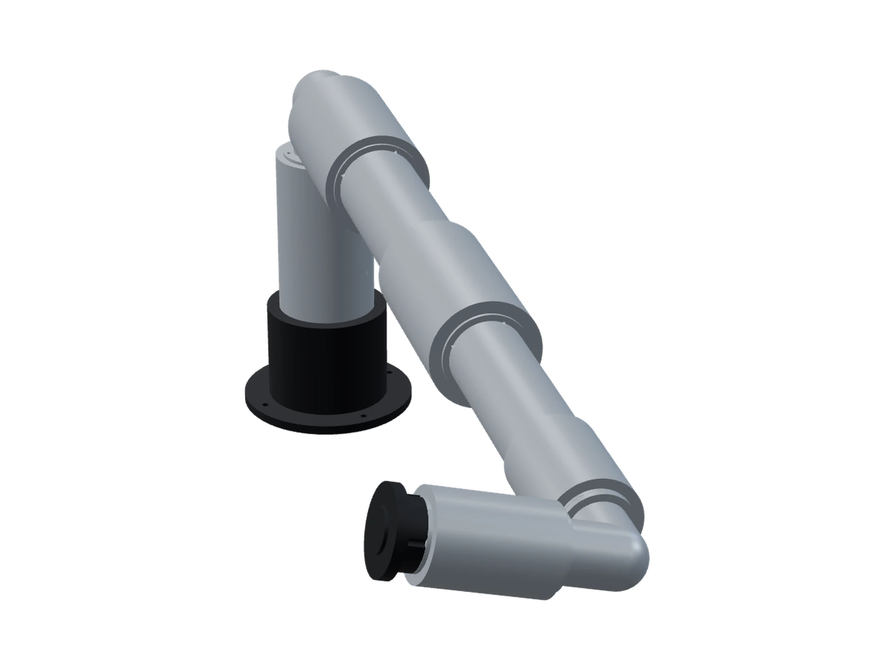
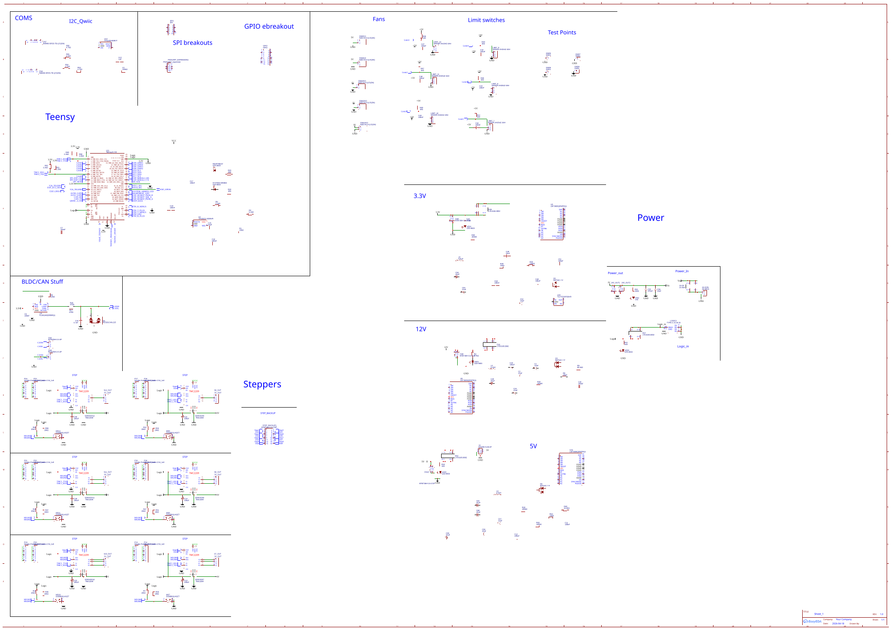

[Back to portfolio](../README.md)

# Six-axis robot arm, from CAD to firmware

**V4 design, Teensy controller, ROS2 driver stack** 
2026 | Design, electronics and firmware

A complete 6-axis robot arm from SolidWorks CAD to ROS2 Jazzy firmware. The V4 design uses closed-loop NEMA-17 steppers with TMC2209 drivers, a custom Teensy 4.1 controller, and inverse-kinematics control with vision-guided pick-and-place.

<table><tr><td align="center"><b>6</b> axes</td><td align="center"><b>24</b> schematic sheets</td><td align="center"><b>65</b> STEP files</td><td align="center"><b>ROS2 Jazzy</b> driver stack</td></tr></table>

`SolidWorks` `Fusion 360` `KiCAD` `Teensy 4.1` `ROS2 Jazzy` `Python` `OpenCV`

## CAD and mechanical design

**Problem**

- A 3D-printed robot arm needs to balance stiffness, weight, and printability across six joints.
- Each link carries both its own motors and the load of everything downstream. Joint geometry and material choice directly impact positional accuracy.

**Constraints**

- 3D printing in PETG on consumer hardware (Prusa MK4) limits layer adhesion and thermal cycling performance.
- Every joint must use standard M3 fasteners and heat-set inserts for repeatable assembly.

**What I built**

- The arm is designed around closed-loop NEMA-17 steppers with TMC2209 drivers, with each link shaped to minimize print-in-place supports while maintaining torsional stiffness.
- SolidWorks handles primary structural design and FEA stress analysis on high-load joints. Fusion 360 covers organic fillets and export workflows.
- All joints use captured M3 heat-set inserts for repeatable disassembly. The full assembly is parameterized so link lengths and motor mount offsets can be adjusted without redrawing.
- The 3D model on the site is posed on the intended UR-style kinematic frames. The current printed V4 stack is a coaxial joint stack.

<table><tr><td align="center"><b>6</b> axes</td><td align="center"><b>65</b> STEP files</td><td align="center"><b>Parametric</b> assembly for rapid iteration</td><td align="center"><b>Print-ready</b> STL pack with orientations</td></tr></table>

## V3 controller board

**Problem**

- Coordinating six independent stepper motors requires precise timing, real-time fault detection, and bidirectional communication with high-level controllers.
- A breadboard of modules adds latency and debug friction compared to a single integrated board.

**Constraints**

- The PCB must fit inside the robot arm base without compromising structural integrity.
- Power delivery for six stepper motors plus microcontroller needs stable 5V and 3.3V rails with thermal headroom.

**What I built**

- A four-layer KiCAD-designed PCB consolidates stepper motor control, Teensy 4.1 microcontroller, and regulated 5V and 3.3V power rails onto a single compact board.
- Four independent TMC2209 stepper driver footprints provide current control and diagnostics for each motor.
- The V2 engineering change order documents a corrected 5V regulated rail, Teensy 4.1 connection details and pinout, and a dedicated buck-rail power distribution sheet.
- Three written design reviews address Teensy connections, MCU comparison (ESP32-S3 versus Teensy 4.1), and final checklist. These confirm electrical correctness and thermal margins.

<table><tr><td align="center"><b>4-layer</b> board design</td><td align="center"><b>24</b> schematic sheets</td><td align="center"><b>6x TMC2209</b> stepper drivers</td><td align="center"><b>3 design reviews</b> with decision trade-offs</td></tr></table>

## Firmware and ROS2

**Problem**

- Real-time control of six synchronized motors requires modular, maintainable firmware that separates motion control, safety, and communication concerns.
- External schedulers (like ROS2 trajectory_msgs) need a clean interface to command the arm without fighting over low-level details.

**Constraints**

- Firmware must enforce joint limits and detect electrical faults (stalled motors, overcurrent) in real time.
- ROS2 messaging overhead must not interfere with the stepper pulse timing (microsecond-level determinism).

**What I built**

- The firmware is organized into four modules: motion.cpp handles trajectory interpolation and velocity control, safety.cpp enforces joint limits and fault detection, protocol.cpp manages serial command framing, and PROTOCOL.md documents the interfaces.
- All modules build under PlatformIO targeting the Teensy 4.1, producing a unified binary with no external dependencies beyond the TMC2209 and motor drivers.
- The ROS2 Jazzy driver stack includes arm_bringup and arm_description packages with launch files and joint_limits.yaml for hardware constraints.
- Xbox controller and keyboard teleop nodes provide real-time joystick and keystroke input for manual control during commissioning.

<table><tr><td align="center"><b>ROS2 Jazzy</b> driver stack</td><td align="center"><b>motion.cpp</b> trajectory control</td><td align="center"><b>Xbox and keyboard</b> teleop interface</td><td align="center"><b>Microsecond timing</b> stepper synchronization</td></tr></table>

## Related projects

- [6-DOF robot arm V2 (CM5 + TMC2209)](../projects.md#6-dof-robot-arm-v2-cm5--tmc2209)
- [Pi robot arm, full CAD design](../projects.md#pi-robot-arm-full-cad-design)
- [V3 ARM Controller PCB](../projects.md#v3-arm-controller-pcb)
- [Robot Arm Firmware and ROS2](../projects.md#robot-arm-firmware-and-ros2)
- [V2 Controller PCB Engineering Change Order](../projects.md#v2-controller-pcb-engineering-change-order)
